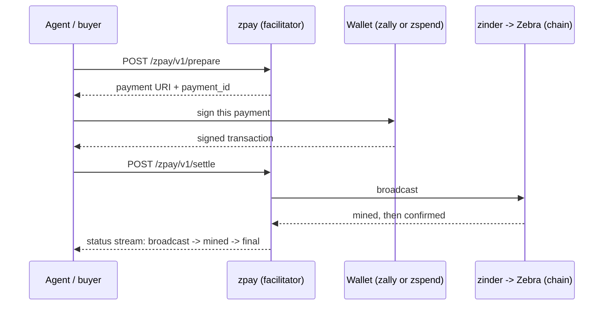
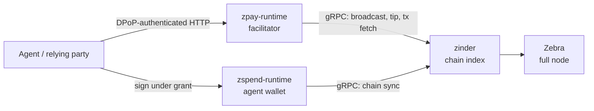

# zpay

A Zcash payments stack for agents and the services they pay. A payee
registers what it charges, an agent asks zpay for an invoice, a wallet
signs the transaction, and zpay broadcasts it and tracks confirmations
until the payment is final. zpay never holds funds and never sees a
spending key.

The workspace ships three binaries that split the roles:

| Binary | Role |
|---|---|
| `zpay-runtime` | The facilitator. Composes invoices, verifies and broadcasts signed transactions, and tracks confirmations. Speaks [x402](https://www.x402.org/) (the open protocol where a server answers an unpaid request with HTTP 402 and a machine-readable payment challenge) plus its own Zcash lifecycle API. |
| `zspend-runtime` | The agent wallet. Holds a sealed spending seed and signs only under a bounded, user-approved authorization grant. |
| `zpay-demo` | A browser checkout demo that wires the two together against testnet. |

New here? Read [How a payment flows](#how-a-payment-flows), then run
[Quick start](#quick-start). Integrating a payee or agent? Jump to
[Integrating as a payee or agent](#integrating-as-a-payee-or-agent) and
the [Wire surface](#wire-surface) reference. Operating a deployment?
Start at [Deploy](#deploy) and the [runbooks](docs/runbooks/). For the
browser demo, use [docs/runbooks/demo-ui.md](docs/runbooks/demo-ui.md).

## How a payment flows

Three neighbors appear in this flow: zally (the wallet library a
relying party embeds), zinder (the chain indexer), and Zebra (the
Zcash full node behind it).



Behind that sequence sit four typed stages:

1. **Advertise.** An operator-registered payee TOML describes what each
   `(payee_id, scheme, network)` accepts: recipient address, amount,
   expiry delta, validity window.
2. **Prepare.** An agent posts `(payee_id, scheme, network)` to
   `/zpay/v1/prepare`, authenticated by a key-bound request proof
   ([DPoP](https://datatracker.ietf.org/doc/html/rfc9449)). The
   facilitator resolves the offer, derives expiry from a chain-tip
   oracle, composes a structured memo (ZIP-302) server-side, and
   returns a payment URI ([ZIP-321](https://zips.z.cash/zip-0321)) plus
   a stable `payment_id`.
3. **Settle.** The wallet signs and posts the transaction to
   `/zpay/v1/settle`. zpay checks the memo version and that the signed
   expiry height matches the prepared row, broadcasts through zinder,
   and records the outcome in libSQL.
4. **Confirm.** A background oracle and a live chain-event subscription
   track confirmations and emit per-payment snapshots over Server-Sent
   Events. Statuses can regress: a payment whose block is reorged away
   returns to `broadcast` until it re-mines or its expiry lapses.
   `settled` is not a status value but a separate boolean on the
   snapshot: it latches true once the payment's block sits at or below
   zinder's settled tip (the height zinder considers reorg-proof), and
   only then is the payment immutable. See
   [ADR-0009](docs/adrs/0009-settlement-lifecycle-and-finality.md).

For receipts, `POST /zpay/v1/verify` accepts a payment disclosure: a
proof the payer's wallet exports so a third party can check the
payment without holding a viewing key. The verifier accepts ZIP-311
Draft1 Sapling evidence or the explicitly versioned Zally Ironwood
extension, fetches the exact mined transaction through zinder, and
reports independent cryptographic, chain-presence, amount, recipient,
and disclosure-message postures.

## Quick start

The reproducible path is the bundled Docker image. Compose brings up
two containers, zpay and the zspend wallet runtime. Chain access comes
from a [zinder](https://github.com/gustavovalverde/zinder) you run
separately: the compose file reaches it as `http://zinder-query:9101`
over a shared Docker network, and `ZPAY_CHAIN_SOURCE_URL` overrides
the address. Both networks in the file are `external: true` and belong
to whichever stack creates them first; for standalone use, comment out
the `networks:` blocks as the file's header describes.

```bash
docker compose up -d
curl -s http://127.0.0.1:8080/healthz
# {"status":"alive"}
```

The image bakes `etc/aether-demo.toml`, a sample payee config with a
placeholder recipient address; the runtime refuses to start with the
placeholder unless `ZPAY_ALLOW_DEMO_PAYEE=1` is explicitly set, so a
production deploy that forgets to override the payees file fails loud
at boot. The compose file sets that flag and additionally bind-mounts
a developer-local `etc/aether-demo.local.toml` (gitignored) over the
baked config, so a compose stack can pay a real testnet address.

Cargo run for local development:

```bash
ZPAY_NETWORK=testnet \
ZPAY_ALLOW_DEMO_PAYEE=1 \
ZPAY_PAYEES__CONFIG_PATH=$(pwd)/etc/aether-demo.toml \
cargo run --release --bin zpay-runtime
```

The HTTP listener binds on `ZPAY_SERVER__BIND_ADDR` (default
`127.0.0.1:8080`). The operations listener binds on
`ZPAY_OPS__BIND_ADDR` (default `127.0.0.1:9295`) and serves `/healthz`,
`/readyz` (a live chain probe, a store probe, and chain-view freshness,
each reported per dependency), and Prometheus `/metrics`.

## Integrating as a payee or agent

The payee registry is operator-owned: whoever runs the zpay instance
edits its `payees.toml`. If you operate your own facilitator, that is
you. Your service returns the HTTP 402 challenge to its own clients;
zpay is the facilitator behind it, not merchant middleware. The
expected flow for an agent or a merchant backend:

1. Register the payee in your `payees.toml`. Each entry carries one or
   more `accepts[]` templates describing `(scheme, network, pay_to,
   amount_zat, max_validity_seconds, expiry_delta_blocks?)`.
2. Mint a DPoP ES256 keypair. Persist the seed in a stable secret so
   the JKT (the key's RFC 7638 thumbprint, the caller identity zpay
   sees) survives process restarts and idempotency keeps working.
3. Compute a deterministic `idempotency_key` from the intent
   (user, task, item, amount). The facilitator resolves replays of the
   same key to the same `payment_id`.
4. `POST /zpay/v1/prepare` with a DPoP header carrying `htm=POST`,
   `htu=https://your-zpay-host/zpay/v1/prepare`, `iat` within 60s, and a
   fresh `jti` (a single-use proof nonce). The response is `{ payment_id, payment_uri,
   memo_bytes, expiry_height, amount_zat }`.
5. Hand `payment_uri` to the user's wallet for signing. The wallet posts
   the signed transaction back through your own surface; you forward
   it to `POST /zpay/v1/settle` with a DPoP proof from the same
   keypair.
6. Subscribe to `GET /zpay/v1/payments/{payment_id}/events` to observe
   the lifecycle. Treat `final` as a confirmation-depth milestone, not
   settlement: a reorg can return a `mined` or `final` payment to
   `broadcast`, and the stream stays open until the payment is
   `settled` (or reaches `expired`, `failed`, or `never_issued`).

The [aether scenario](https://github.com/gustavovalverde/zentity/tree/main/apps/demo-rp/src/app/aether)
in the demo relying party of zentity, a sibling identity platform,
demonstrates the full path including an out-of-band user approval
(CIBA, Client-Initiated Backchannel Authentication) and a
six-character phishing-prevention code derived from the URI.

## Wire surface

Every JSON response body is the bare inner type. Errors follow
[RFC 7807](https://www.rfc-editor.org/rfc/rfc7807) as `application/problem+json`.

The official x402 facilitator surface is intentionally small:

| Method | Path | Auth | Purpose |
|---|---|---|---|
| GET | `/x402/v2/supported` | none | List official x402 scheme and network pairs supported by this facilitator |
| POST | `/x402/v2/verify` | none | Verify an official x402 facilitator request |
| POST | `/x402/v2/settle` | none | Settle an official x402 facilitator request |

`/x402/v2/supported` advertises the configured Zcash network for the
Zcash `exact` binding. The binding is `x402-zcash-exact-v1`:
`scheme: "exact"`, `asset: "ZEC"`, integer zatoshi `amount`, ZIP-316
Unified Address `payTo`, and `payload.format: "pczt-v2-extractable"`.
`/x402/v2/verify` parses and verifies the signed PCZT (Partially
Created Zcash Transaction, Zcash's analogue of a PSBT) payment
effects;
`/x402/v2/settle` extracts and broadcasts the same PCZT.

PCZT extraction loads Sapling verifying parameters from the platform
default ZcashParams directory; container stacks mount
`${ZCASH_PARAMS_HOST_DIR:-${HOME}/.local/share/ZcashParams}` into the
zpay runtime for that reason. Requests derived from `/zpay/v1/prepare`
may include `extra.zpayPaymentId`; when present, `/x402/v2/settle`
records the broadcast outcome against that lifecycle row. See
[ADR-0010](docs/adrs/0010-x402-public-boundary.md) and
[ADR-0011](docs/adrs/0011-zcash-x402-exact-binding.md).

The zpay Zcash lifecycle surface is product-owned and used by the demo,
`zpay-e2e`, and local integrations:

| Method | Path | Auth | Purpose |
|---|---|---|---|
| GET | `/healthz` | none | Liveness; returns `{"status":"alive"}` |
| GET | `/zpay/v1/accepts?payee_id=…` | none | List the payee's accepted `(scheme, network, pay_to, amount_zat)` offers |
| GET | `/zpay/v1/tip?network=…` | none | Chain-tip height the prepare path uses for expiry math |
| POST | `/zpay/v1/prepare` | DPoP | Allocate a `payment_id`, return a ZIP-321 URI and memo bytes |
| POST | `/zpay/v1/settle` | DPoP | Broadcast a wallet-signed transaction; jkt must match the prepare proof |
| POST | `/zpay/v1/verify` | none | Verify a ZIP-311 disclosure; five-axis response |
| GET | `/zpay/v1/payments/{id}` | none | Snapshot with `reorg_count` and `settled`; status is `awaiting`, `broadcast`, `mined`, `final`, `failed`, `never_issued`, or `expired` |
| GET | `/zpay/v1/payments/{id}/events` | none | SSE stream of snapshots; closes once the payment is `settled`, `expired`, `failed`, or `never_issued` |

`/prepare` and `/settle` require a [DPoP](https://datatracker.ietf.org/doc/html/rfc9449)
proof signed by the caller's ES256 key; the key's thumbprint (`jkt`)
is the caller's stable identity. Idempotency is scoped by
`(jkt, idempotency_key)`, so two callers sharing an `Idempotency-Key`
header receive distinct payment IDs. A second `/settle` from a different
jkt returns `dpop_mismatch` 403.

Requests are rate limited per DPoP key on authenticated routes and per
client IP elsewhere (`ZPAY_RATE_LIMIT__PER_JKT_PER_MINUTE`, default 120;
`ZPAY_RATE_LIMIT__PER_IP_PER_MINUTE`, default 600; `0` disables a
dimension). Over the limit, responses are `429` with a `Retry-After`
header. Forwarded-for headers are ignored unless
`ZPAY_RATE_LIMIT__TRUST_FORWARDED_HEADERS` is set behind a trusted
proxy. Cross-origin browser access is off unless
`ZPAY_SERVER__CORS__ALLOWLIST` names exact origins.

## Agent-wallet trust boundary (zspend)

`zspend-runtime` is the wallet service for autonomous agent payments. It holds
the spending seed (sealed at rest), syncs against zinder, and exposes
`POST /v1/payments/sign`. The facilitator's `/settle` is intent-blind behind a
shielded viewing key, so the wallet is the sole place the spend's intent is
checked. Before it signs, the wallet runs four checks:

1. verifies a DPoP-bound `payment_authorization` access token (an
   RFC 9396 rich-authorization grant naming what may be spent),
2. pins the token's `aud` to this wallet instance,
3. re-derives the `intent_hash` and matches it against the signed grant,
4. consults a revocation cache.

It then reserves the token `jti` in a durable single-use ledger,
write-then-sign, so a replay returns the cached payload and a
conflicting reuse is refused.

The wallet exposes `/v1/payments/sign`, `/v1/wallet/address`,
`/v1/capabilities`, `/.well-known/wallet-configuration`, Prometheus
`/metrics`, and a computed `/readyz` that reports JWKS reachability,
revocation-cache state, and the seed's sealing posture. See
[Proposal-0003](docs/proposals/0003-agent-wallet-production-architecture.md) for
the decision record, and the
[Aether demo](https://github.com/gustavovalverde/zentity/tree/main/apps/demo-rp/src/app/aether)
for the end-to-end flow where an issuer mints the token and zspend signs.

## Architecture



Inside `zpay-runtime`, `zpay-x402` owns the HTTP routes, DPoP
middleware, and SSE hub; `zpay-core` owns the lifecycle (prepare,
settle, status, verify, memo binding, registry, chain-tip oracle); and
`zpay-store` persists prepared transactions and the settlement ledger
in libSQL. The binary also runs a separate operations listener with
`/healthz`, `/readyz`, and `/metrics`.

Across the two planes, the agent obtains a signed payload from zspend's
`/v1/payments/sign`, then hands that payload to zpay's `/settle` for
broadcast.

zpay calls [zinder](https://github.com/gustavovalverde/zinder) over gRPC
for broadcast, chain-tip reads, and the transaction fetch the verify path
needs. It depends on neither zinder's HTTP surface nor the chain
directly; the only public HTTP in this loop is zpay's own.

## Repository layout

```text
zpay/
  Cargo.toml                workspace root
  Dockerfile.<service>      per-service multi-stage release builds
                              (zpay, zspend, zpay-demo)
  docker-compose.yml        local dev: zpay + zspend with the dev-only
                              payee bypass
  railway.<service>.toml    per-service Railway deploy configs (zpay, zspend, zpay-demo)
  rust-toolchain.toml       1.95
  crates/
    zpay-core/              types, lifecycle, traits, ZIP-302 binding,
                              ZIP-311 verifier
    zpay-dpop/              pure RFC 7638 JWK thumbprint and RFC 9449 htu
                              canonicalization
    zpay-store/             libSQL impls of PreparedTxStore and
                              SettlementLedgerStore + migrations
    zpay-x402/              x402 v2 HTTP routes, SSE hub, DPoP middleware
    zpay-runtime/           binary, env-driven config, oracle wiring,
                              composition root
    zpay-demo/              browser checkout demo gateway; serves the
                              frontend built from demo/ at the repo root
    zpay-e2e/               integration harness (zally as the wallet
                              counterparty)
    zpay-testkit/           dev and test DPoP-bound agent payment client
                              fixtures shared by zpay-demo and zpay-e2e
    zspend-core/            agent-wallet trust-boundary vocabulary: the
                              payment_authorization RAR, at+jwt and DPoP
                              verification, intent-hash, SigningPolicy
    zspend-runtime/         wallet binary: sealed-seed zally wallet,
                              /v1/payments/sign, single-use jti ledger,
                              revocation check, posture gate
  etc/
    aether-demo.toml        placeholder payee config baked into the image
    aether-demo.*.toml      network-specific and local overrides
  scripts/
    deploy-to-railway.sh    self-contained Railway uploader
    test-persistence.sh     end-to-end persistence probe
    test-sse.sh             SSE wire contract probe
    test-cold-start.sh      empty-volume migration probe
    test-payee-override.sh  payees TOML bind-mount probe
    mint-dpop-proof.py      ES256 proof helper used by probes
  docs/
    product-requirements.md whole-product PRD
    architecture/           wire vocabulary, plane boundaries
    adrs/                   locked architectural decisions
    runbooks/               operational procedures (Railway deploy,
                              reorg recovery, zspend seed)
    reference/              error vocabulary
    proposals/              asks against sibling repos
```

## Deploy

Railway is the supported managed path. The runbook covers the env-var
matrix, volume provisioning, and the cross-service wiring to zinder:

```bash
./scripts/deploy-to-railway.sh <zpay|zspend|zpay-demo|all>
```

See [docs/runbooks/railway-deploy.md](docs/runbooks/railway-deploy.md)
for the service matrix, first-deploy checklist, and rollback
procedure. The per-service Dockerfiles are the source of truth for the
builds; Docker Compose mirrors them locally with the dev-only
`ZPAY_ALLOW_DEMO_PAYEE=1` flag flipped on.

## Validation gate

Every change in this repository must pass:

```bash
cargo build --release
cargo clippy --workspace --all-targets -- -D warnings
cargo test --workspace
docker buildx build -f Dockerfile -t zpay-runtime:dev .
./scripts/test-persistence.sh
./scripts/test-sse.sh
./scripts/test-cold-start.sh
./scripts/test-payee-override.sh
```

Container probes run against the rebuilt image to lock the wire
contract; treat any change to a probe assertion as a wire-shape decision.

## Documentation

| Document | Purpose |
|---|---|
| [Product requirements](docs/product-requirements.md) | Problem, positioning, capability requirements |
| [Public interfaces](docs/architecture/public-interfaces.md) | Vocabulary spine; mandatory read before any new identifier |
| [Operational surfaces](docs/architecture/operational-surfaces.md) | Env-var schema, readiness, ops port |
| [Facilitator plane](docs/architecture/facilitator-plane.md) | Lifecycle and typed errors across boundaries |
| [Error vocabulary](docs/reference/error-vocabulary.md) | Every typed error, retry posture, operator action |
| [Runbooks](docs/runbooks/) | zpay lifecycle smoke test, Railway deploy, reorg recovery, zspend seed ceremony |
| [ADR index](docs/adrs/) | Locked architectural decisions, including [ADR-0006](docs/adrs/0006-facilitator-trust-boundary.md) (trust boundary), [ADR-0008](docs/adrs/0008-compliance-authority-placement.md) (compliance authority), and [ADR-0009](docs/adrs/0009-settlement-lifecycle-and-finality.md) (settlement finality) |

## Ecosystem position

zpay sits next to two sibling projects in the Zcash agent stack:

- [zally](https://github.com/gustavovalverde/zally) is the wallet
  library; relying parties typically run zally to sign the transaction
  the facilitator hands back as a ZIP-321 URI.
- [zinder](https://github.com/gustavovalverde/zinder) is the chain
  index; zpay reads chain tip, fetches transactions, and broadcasts
  through its gRPC surface.

Both upstreams are pinned by git rev in `Cargo.toml`; bump the rev to
promote upstream changes into zpay. The pinned line tracks Ironwood,
the NU6.3 network upgrade: Zebra is the only full validator past
activation, `/settle` parses both current transaction formats (v5 and
v6), and zinder stores below artifact schema 12 must be wiped and
resynced. See
[upstream platform binding](docs/architecture/upstream-platform-binding.md).

## License

MIT. See [LICENSE](LICENSE).

## Contributing

Read [AGENTS.md](AGENTS.md) before opening a PR. Wire-shape changes are
expensive to revert; check the vocabulary spine in
[docs/architecture/public-interfaces.md](docs/architecture/public-interfaces.md)
first.
